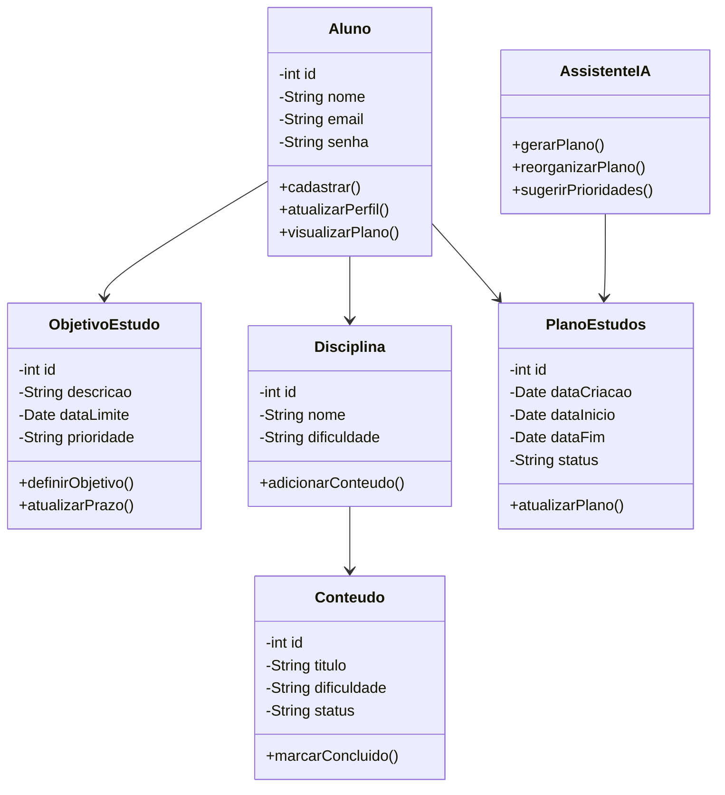

# 🤖📚 Projeto: Plano de Estudos com IA

Olá, Seja muito Bem-vindo(a) ao nosso projeto! Nossa proposta é um assistente de planejamento de estudos personalizado, desenvolvido com Inteligência Artificial para auxiliar estudantes na organização de sua rotina e no alcance de seus objetivos.

#  Sobre o Projeto:

A plataforma consiste em um assistente de planejamento de estudos personalizado, desenvolvido com IA para auxiliar estudantes na preparação para vestibulares, concursos públicos ou outros objetivos. 

Alinhada à ODS 4 — Educação de Qualidade, a solução busca democratizar o acesso à orientação de estudos, enfrentando problemas como falta de direcionamento, dificuldade na organização do tempo e cronogramas pouco realistas, que podem levar à desmotivação e à desistência.

A Inteligência Artificial é o principal diferencial da nossa plataforma, utilizando um modelo integrado por API para analisar os objetivos, disponibilidade, prazos e progresso de cada usuário. A partir desses dados, a IA gera cronogramas personalizados, recomenda prioridades, produz resumos de conteúdos, tornando a orientação de estudos mais acessível, prática e adaptativa, especialmente para estudantes que não possuem condições de investir em mentorias ou cursinhos.

## 🧩 Diagrama de Classes:

https://app.diagrams.net/?tags=%7B%7D&lightbox=1&highlight=0000ff&edit=_blank&layers=1&nav=1&title=Diagrama%20Contexto%20do%20Sistema%20.drawio&dark=auto#R%3Cmxfile%3E%3Cdiagram%20name%3D%22P%C3%A1gina-1%22%20id%3D%22Fx5YuHXEn6CJSMVBnzI0%22%3E7Zttd6I4FMc%2FjS%2FrIUFAX6ptZ2dPZ053ujM78zJC1MwAYSFanU%2B%2FNyEgAfRotdbT1dMquSQhD%2F%2F8uLlixx5Hqw8pSeafeEDDDraCVce%2B7WCMLdeCD2lZ5xaEcC%2B3zFIWaNvG8MR%2BU23UBWcLFtDMyCg4DwVLTKPP45j6wrCRNOXPZrYpD82rJmRGG4Ynn4RN6z8sEPPc2sfexv4HZbN5cWXkDvIzESky655kcxLw54rJvuvY45RzkR9FqzEN5egV45KXu99ytmxYSmPRUoBPfsrxgBwh8ekc%2Bk3T2pD1PpNId3MYLmJemP9eJ9r8CGV4XNhvaeanLBEMTOr012zRGdudIUoZl5NM8ssJMuVpJBMBhTcaZ6yoPCQTUIgq3MFuCA0fTXksm5mJtR5z998FL07cZEoRQ8iA3GS1OQlHM%2F2paplsDI7uGHaKkzAok3oBsOVXNs0BW5YmJ69MDQdU5txWylbzFU1Id1V2aG%2FRrt7qWnwe8tSopYNtX73ayjrmFBrj0zYW9W7iivw%2BI%2F6NJOsQz737v%2F6Mfvz4%2FjC5QaWsS7lW9al1t%2Bk7notIqgHpLunlj2Q6INmcyotZkHieM0GfEhAyGJ4BNbIAC8NxOQC21bfvPQfsmUj5L1o949rIGetLVOxT9ZIl5kQJPlrNJMW6fq%2BbKOFDZ0YkZDMpdx%2B6QaHkKKKC3AVM6HYnnMVCLSxHKsbqwqiOLfUvBTMGG5IpbTdtnmnUBlQzttlwi7G1SvPa8GePUgo6IxM1CVY5s0uaCrqqzJSeyA%2BUQ5fTNWSZV0nX11x73mARW9pWVFOkNf17Okk0iGZl1RtuwYEWT5HUJHsJ1YKIxQwEAeSFxWkdDLgvNEt4nOWQW6p7W6JqmlGQtc9IqiCX0XjJwyWLQCMKhPItA8nC2gGhoc0gX%2Fn3nvlnX%2Fl35V%2BFf07P5J9zZv7dAZUW4IeNmuB74lPxDNoE89M6EzTaysDHrQ6dBTNPZxKusk%2Fw%2F3F4pdz7p1zvUMqlfBEHimVoC8sqHFTaGRH%2F10wVK3gV85g2oYcsF42sHWhr0IukfkFZqxWWt441QE3M1ZnRwB5ucq%2BNhSWgmjDEbYS8CGpWbNhE6cvQiVvQ2TPRaddcR%2FvcvuNHEAyIR7l%2BQ%2BnqwflhKtiUwXHY6kzuz9QP2n0sHUaaNysuEzQTi%2BC6af4f4NS5HJz2x%2F3ewD0lTj3b9fr4itO3xqlbc0SP90QbAclWcWM7vw4NGmHWpsT5IvXpjsrcxlKQ1T7pJE%2FFnM94TMK7jXW0WSxSZps8D5wnWos%2FqRBrrWKyAB4bC4iumPgui3fV7komf%2Bja5PHtqppYVxKPNGUwpnKZ5LYYxlfWhLqWhQqDqqvbt3Fh2FSoUutqql5lPh6CpDMq9nTYKhpKKXj2bGnOS5sgdNFHuUY3kvLQoOtWXp4Z6unXFJa3UtdRE1nZqDbd7Sk0%2FbWC%2Fh5Ao6VTRt%2Bretup1Jq6HvJ7b1URDQjK9cp8Eg71iYgFQS6%2BnZSrLHgSLmgRcRI8jUkxPdL9GNkqvO6SSLI9nmTJIaRonWVdBPjjDdy9J77IwqfTjB44i4c5XyMS%2B6UrFMAGMzvS4bonv6mM1YV0SWJh%2Bl1F%2FUkqh534PEpIPN8W2qtugCvBPevqqr1%2FV829umpXV%2B21XbVG0NA9884XelzQ1BqDuuhKQJd3xBJlJsJimj75PKEjKV6im9fG4m8s%2F0LFljyFnbDcTZck%2FRoKpiKNRCxAwr%2BJyuoVBSQ7yrwI7vn31gDesIXd8wG4Ar%2BWWuV43ejVN1S3nKnYQqsmxluIeijcj2vSVoAeRkrvUFIqlRk4NAHVQkFtKkCnOtV0xoT081vRa24NatQjYcifh8UDJFaNg4qLXBBR4aLpeeYl%2FEWage%2F1heYq03sDcC%2BCKkxperekOVOvgD0OsL0WvromX20Tr8g6nq%2F7bVH6J9wKNxfQ222Fi1Mv2AqXiXwb7FzwJniLEvab%2BsGRm9P%2BRexNd7j9zb2BecsY%2BjTLGo%2BHQb9JGevOmlvcxuXGJCDyvrD7jvmC9p1kO31jdW1vYMZB8Fl21%2FupEJ0yGNceLjkbgfCJCFQLxOF3iyB0bIAMXUaAbCdJKo9lvUK4TK5vNLCN9X1zUQvcOeEC773tAj%2BVh9HtOZ65xi3kveIidw7Q1VbRwMaDrCsZ9LrYGovv4VrMwKo9PF7Lj9xB18O7isBB3ojTCvRYR6hQ%2BBtD6KEljMziHEZlvGLk0KzFJflEoD35IwQBDJZ6tBQa1hLhb3eHXsFxgTWBsck155Kw5l6x1sCaY0DtFYHmHqCnNwOa6x2Z3z0D%2FWq%2FVXoB%2Fdq%2FAT83%2Feq7sAqObmlGo4TGc4lF2kSYRWUY2YzpvirXbLvmr%2B3%2FPffrgw2fEmxv%2FHTEqTZkZwwJHaKok5HNrT3Y6KHdpOodlR3Z5%2BCadyTX8GVw7UvtiYuTEKjXswdnQQ4kNz8mzbNvfpNr3%2F0H%3C%2Fdiagram%3E%3C%2Fmxfile%3E
