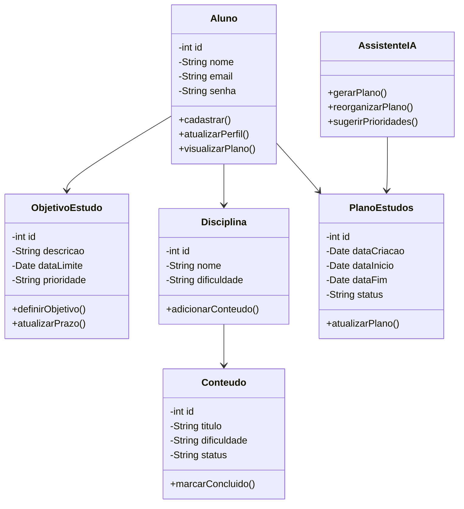

# 🤖📚 Projeto: Plano de Estudos com IA

Olá, Seja muito Bem-vindo(a) ao nosso projeto! Nossa proposta é um assistente de planejamento de estudos personalizado, desenvolvido com Inteligência Artificial para auxiliar estudantes na organização de sua rotina e no alcance de seus objetivos.

#  Sobre o Projeto:

A plataforma consiste em um assistente de planejamento de estudos personalizado, desenvolvido com IA para auxiliar estudantes na preparação para vestibulares, concursos públicos ou outros objetivos. 

Alinhada à ODS 4 — Educação de Qualidade, a solução busca democratizar o acesso à orientação de estudos, enfrentando problemas como falta de direcionamento, dificuldade na organização do tempo e cronogramas pouco realistas, que podem levar à desmotivação e à desistência.

A Inteligência Artificial é o principal diferencial da nossa plataforma, utilizando um modelo integrado por API para analisar os objetivos, disponibilidade, prazos e progresso de cada usuário. A partir desses dados, a IA gera cronogramas personalizados, recomenda prioridades, produz resumos de conteúdos, tornando a orientação de estudos mais acessível, prática e adaptativa, especialmente para estudantes que não possuem condições de investir em mentorias ou cursinhos.

## 🧩 Diagrama de Classes:

