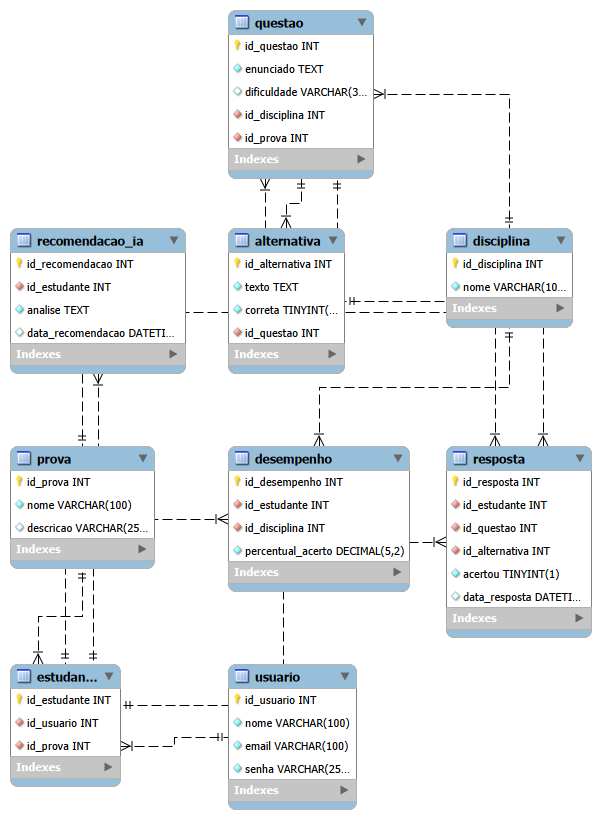
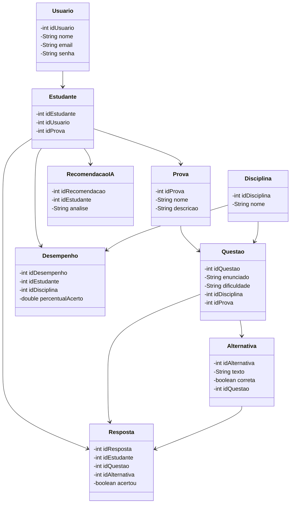

# 🎓 Evolua+ — Plataforma Educacional com Inteligência Artificial

## 📚 Sobre o Projeto

O Evolua+ é uma aplicação educacional desenvolvida para auxiliar estudantes na preparação para provas, como ETEC, ENEM, vestibulares e concursos.

O projeto está alinhado à ODS 4 — Educação de Qualidade, buscando utilizar tecnologia e Inteligência Artificial para apoiar o processo de aprendizagem e fornecer ao estudante uma análise personalizada de seu desempenho.

Nesta etapa foi desenvolvido um MVP (Produto Mínimo Viável), concentrando o sistema nas funcionalidades essenciais para validar a proposta.

## 🎯 Funcionalidades principais do MVP

O MVP foi concentrado em três funcionalidades principais:

1. Realização e armazenamento de um simulado.
2. Cálculo do desempenho do estudante e análise dos erros utilizando Inteligência Artificial.
3. Geração, armazenamento e exibição de recomendações personalizadas de estudo.

O sistema também possui funcionalidades de apoio, como cadastro, login e identificação do estudante.

## 🤖 Inteligência Artificial

A Inteligência Artificial é utilizada para analisar o desempenho do estudante após a realização do simulado.

O sistema considera informações como:

- percentual de acertos;
- questões respondidas incorretamente;
- disciplina relacionada;
- desempenho registrado no banco de dados.

Essas informações são utilizadas para montar um prompt enviado a um modelo de IA por meio da API da OpenRouter.

A resposta gerada contém recomendações personalizadas de estudo e é armazenada no banco de dados para ser apresentada ao estudante.

## 🛠️ Tecnologias utilizadas

- Java 25
- Spring Boot 3.5.6
- Maven
- MySQL 8.0
- MySQL Workbench
- HTML
- CSS
- JavaScript
- OpenRouter API
- IntelliJ IDEA
- Git
- GitHub
- GitHub Projects

## 🗃️ Banco de Dados

O banco de dados utilizado pelo projeto é o MySQL.

O MVP possui 9 entidades/tabelas principais:

1. Usuario
2. Estudante
3. Prova
4. Disciplina
5. Questao
6. Alternativa
7. Resposta
8. Desempenho
9. RecomendacaoIA

Essas entidades representam o núcleo necessário para o funcionamento do simulado, armazenamento das respostas, cálculo de desempenho e integração com Inteligência Artificial.

## 🗺️ Modelo Entidade-Relacionamento (MER)

O Modelo Entidade-Relacionamento foi obtido a partir do banco de dados utilizado pela aplicação.



O arquivo editável do modelo criado no MySQL Workbench também está disponível em:

`doc/EvoluaMais_MER.mwb`

## 🧩 Diagrama de Classes

O projeto utiliza Programação Orientada a Objetos e possui como principais classes de domínio:


```mermaid
classDiagram

class Usuario {
    -int idUsuario
    -String nome
    -String email
    -String senha
}

class Estudante {
    -int idEstudante
    -int idUsuario
    -int idProva
}

class Prova {
    -int idProva
    -String nome
    -String descricao
}

class Disciplina {
    -int idDisciplina
    -String nome
}

class Questao {
    -int idQuestao
    -String enunciado
    -String dificuldade
    -int idDisciplina
    -int idProva
}

class Alternativa {
    -int idAlternativa
    -String texto
    -boolean correta
    -int idQuestao
}

class Resposta {
    -int idResposta
    -int idEstudante
    -int idQuestao
    -int idAlternativa
    -boolean acertou
}

class Desempenho {
    -int idDesempenho
    -int idEstudante
    -int idDisciplina
    -double percentualAcerto
}

class RecomendacaoIA {
    -int idRecomendacao
    -int idEstudante
    -String analise
}

Usuario --> Estudante
Estudante --> Prova
Prova --> Questao
Disciplina --> Questao
Questao --> Alternativa
Estudante --> Resposta
Questao --> Resposta
Alternativa --> Resposta
Estudante --> Desempenho
Disciplina --> Desempenho
Estudante --> RecomendacaoIA
```

## 🏗️ Arquitetura

O back-end foi desenvolvido utilizando Java e Spring Boot.

A aplicação está organizada em camadas, incluindo:

- `model` — classes que representam as entidades do sistema;
- `repository` — acesso e persistência dos dados no MySQL;
- `service` — regras de negócio, cálculo de desempenho e integração com IA;
- `controller` — endpoints da aplicação;
- `config` — configuração da conexão com o banco de dados.

O front-end utiliza HTML, CSS e JavaScript e se comunica com o back-end através dos endpoints disponibilizados pela aplicação.

## 🔐 Configuração e Segurança

Informações sensíveis não são armazenadas diretamente no código-fonte.

Para executar o projeto, devem ser configuradas as seguintes variáveis de ambiente:

```text
OPENROUTER_API_KEY
DB_USUARIO
DB_SENHA
```

As senhas dos usuários são armazenadas utilizando hash BCrypt.

As chaves de API e credenciais do banco de dados não devem ser adicionadas ao repositório.

## 🔄 Fluxo principal da aplicação

O fluxo principal do MVP é:

`Estudante → Simulado → Respostas → Cálculo de desempenho → Análise pela IA → Recomendação personalizada`

Após responder às questões, as respostas são armazenadas no MySQL. O sistema calcula o percentual de acertos e identifica os erros. Esses dados são enviados para a integração com IA, que gera uma recomendação de estudo posteriormente armazenada e exibida ao estudante.

## 🌐 Diagrama de Contexto do Sistema — Nível 1

O Diagrama de Contexto apresenta uma visão geral do Evolua+ e das interações do sistema com elementos externos.


## 🏗️ Diagrama de Contêiner — Nível 2

O Diagrama de Contêiner apresenta a arquitetura de alto nível, mostrando os principais componentes tecnológicos do sistema e como eles se comunicam.


## 🚀 Execução do Projeto

Para executar o projeto:

1. Configure o banco MySQL `evoluamais`.
2. Configure as variáveis de ambiente `DB_USUARIO`, `DB_SENHA` e `OPENROUTER_API_KEY`.
3. Abra o projeto no IntelliJ IDEA.
4. Instale/carregue as dependências Maven.
5. Execute a classe `EvoluaMaisApplication`.
6. Acesse a aplicação pelo navegador.

## 📌 Status

MVP funcional com:

- cadastro e login de estudante;
- realização de simulado;
- armazenamento das respostas;
- cálculo de desempenho;
- identificação de erros;
- integração com Inteligência Artificial;
- geração de recomendação personalizada;
- persistência da recomendação no banco de dados;
- documentação do banco através de MER.

## 🌱 ODS

O projeto está relacionado à:

**ODS 4 — Educação de Qualidade**

A proposta busca utilizar tecnologia para apoiar estudantes no processo de preparação e aprendizagem, oferecendo análise de desempenho e orientação personalizada.